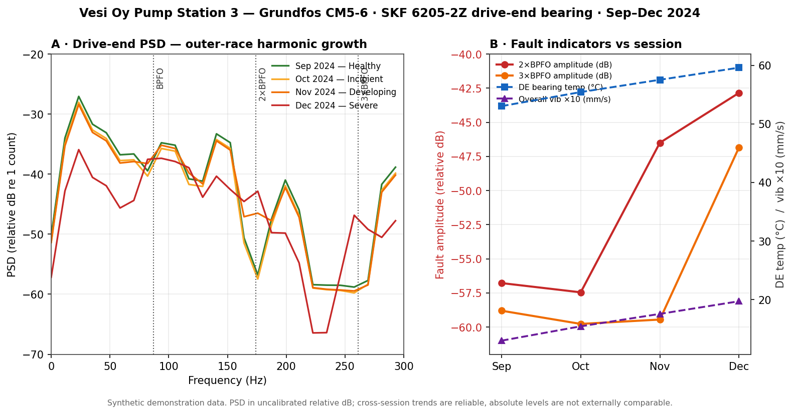

# Condition Monitoring Report — Vesi Oy Pump Station 3

**Asset:** Grundfos CM5-6 centrifugal pump (S/N GF-2021-CM5-00847)
**Monitoring period:** 15 Sep 2024 – 12 Dec 2024 (four sessions)
**Prepared by:** Five-Bot Analysis Pipeline (Planner → Coder → Analyzer → Reporter → Reviewer)

> **Sample output.** This is a complete, unedited example of what the pipeline produces end-to-end, generated from the synthetic Vesi Oy demo dataset (`generate_data.py`). No real client, no real measurements. It exists so a reader can see the deliverable without installing and running the five bots.

---

## 1. Executive Summary

The drive-end bearing of the Pump Station 3 pump is developing an **outer-race fault** and should be inspected within the next planned maintenance window. Across the four monitoring sessions the outer-race fault frequency (BPFO) harmonics rose sharply — **+13.9 dB at 2×BPFO** and **+12.0 dB at 3×BPFO** — while drive-end bearing temperature climbed **+6.6 °C** and SCADA overall vibration rose **+52 %**. Process conditions (flow, speed, power) were stable throughout, so these changes reflect a mechanical fault, not a change in duty. Absolute vibration remains moderate, but the trend is consistent and accelerating; the recommended priority is **urgent inspection of the drive-end bearing**.

---

## 2. Asset & Monitoring Overview

| | |
|---|---|
| **Asset** | Grundfos CM5-6 centrifugal pump, Pump Station 3 |
| **Serial / installed** | GF-2021-CM5-00847 · 15 Mar 2021 |
| **Duty** | Continuous 24/7, demand-controlled secondary distribution booster |
| **Drive-end bearing** | SKF 6205-2Z deep-groove ball bearing |
| **Nominal speed** | 1450 rpm (shaft 24.17 Hz) |
| **Monitoring method** | Drive-end accelerometer (ACC-DE) acoustic capture + SCADA time-series |
| **Sessions** | 15 Sep · 17 Oct · 14 Nov · 12 Dec 2024 |
| **Analysis** | Welch PSD (4096-pt Hann, 50 % overlap) on channel 0; amplitudes extracted at bearing fault frequencies and harmonics |

**Data quality notes (carried through from analysis):**

- **PSD amplitudes are uncalibrated relative dB** (re 1 count). No ADC full-scale voltage was recorded, so absolute levels cannot be compared to external references such as ISO 20816 thresholds. **Cross-session trends are reliable; absolute values are not.**
- **Recording bit depth diverges from metadata.** `measurement_setup.json` specifies a 24-bit DAQ, but all four WAV files are 16-bit PCM. This does not affect trend analysis but indicates the acquisition metadata and the stored recordings are out of sync.
- **Channel 0 assumed to be ACC-DE.** No explicit channel map was present in the measurement records.

---

## 3. Findings

### 3.1 Drive-end outer-race bearing fault — Confidence: High

The clearest signal is a growing series of harmonics at the outer-race fault frequency (BPFO = 87.09 Hz). The fundamental itself rose only modestly (+1.9 dB), but its harmonics grew strongly and monotonically over the last two sessions:

| Fault frequency | Sep | Oct | Nov | Dec | Sep→Dec |
|---|---:|---:|---:|---:|---:|
| BPFO (87.09 Hz) | −39.5 | −40.3 | −38.2 | −37.5 | **+1.9 dB** |
| 2×BPFO (174.18 Hz) | −56.8 | −57.5 | −46.5 | −42.8 | **+13.9 dB** |
| 3×BPFO (261.27 Hz) | −58.8 | −59.8 | −59.5 | −46.8 | **+12.0 dB** |

A harmonic-dominant signature — modest fundamental, strongly rising harmonics — is characteristic of a **localised outer-race defect** generating repetitive impacts as rolling elements pass the damage. The progression is consistent with the four labelled stages (healthy → incipient → developing → severe).

This acoustic finding is corroborated by two independent SCADA channels:

- **Drive-end bearing temperature** rose steadily: 53.0 → 55.4 → 57.5 → **59.6 °C** (+6.6 °C across sessions; +7.3 °C above the 52.3 °C August baseline).
- **Overall vibration** rose 1.30 → 1.54 → 1.76 → **1.97 mm/s** (+52 %).
- **Non-drive-end bearing temperature stayed flat** at ~48.0 °C across all sessions, which **localises the fault to the drive end** rather than to a shaft-wide or system-wide cause.

Three independent indicators (acoustic harmonics, bearing temperature, overall vibration) moving together, with the NDE bearing unaffected, give high confidence in a developing drive-end bearing fault.

### 3.2 No evidence of a hydraulic or impeller fault — Confidence: High

The blade-pass frequency (145.0 Hz, 6 blades × shaft speed) did **not** rise — its amplitude fell over the period. Combined with stable flow and head (Section 4), there is no indication of an impeller, cavitation, or blade-pass problem. The fault is mechanical and bearing-specific.

---

## 4. Operational Context

Process conditions were stable across all four sessions, which is what makes the fault indicators meaningful:

| Session | Flow (m³/h) | Speed (rpm) | Power (kW) |
|---|---:|---:|---:|
| 15 Sep | 7.89 | 1450 | 1.58 |
| 17 Oct | 7.77 | 1450 | 1.57 |
| 14 Nov | 7.77 | 1450 | 1.57 |
| 12 Dec | 7.83 | 1450 | 1.58 |

Flow ran slightly below the 8.5 m³/h design point but was consistent session to session; speed and power were essentially constant. Because duty did not change, the rising temperature and vibration **cannot be attributed to a change in operating condition** — they reflect deterioration of the machine itself.

---

## 5. Recommendations

1. **Urgent — Inspect the drive-end bearing (SKF 6205-2Z).** All three indicators point to a developing outer-race defect. Inspect for outer-race pitting/spalling and replace if confirmed. Target the next planned stop, and no later than **4 weeks**, given the accelerating trend.
2. **Immediate — Verify drive-end lubrication.** Confirm grease condition, quantity, and that the bearing is neither over- nor under-greased; the steady temperature rise is consistent with early bearing distress and should be checked before it advances.
3. **Monitor — Shorten the measurement interval to monthly** until the bearing is serviced, and **re-measure after service** to confirm the BPFO harmonics and bearing temperature return toward the September baseline. Consider running the identical warm-standby pump (S/N GF-2021-CM5-00848) if failure risk during peak demand is a concern.
4. **Housekeeping — Reconcile acquisition metadata.** Correct the DAQ resolution record (24-bit vs 16-bit actual) and capture ADC full-scale voltage and sensor sensitivity so future PSD results can be absolute-calibrated and compared against ISO 20816 limits.

---

## 6. Appendix: Data Summary

**Fault-frequency amplitudes (relative dB re 1 count; trend reliable, absolute not comparable)**

| Frequency | Label | Sep | Oct | Nov | Dec |
|---|---|---:|---:|---:|---:|
| 87.09 Hz | BPFO | −39.5 | −40.3 | −38.2 | −37.5 |
| 174.18 Hz | 2×BPFO | −56.8 | −57.5 | −46.5 | −42.8 |
| 261.27 Hz | 3×BPFO | −58.8 | −59.8 | −59.5 | −46.8 |
| 145.0 Hz | Blade pass | −33.3 | −34.2 | −34.5 | −40.3 |

**SCADA summary (±6 h window around each session, n≈73 samples per session)**

| Session | Flow (m³/h) | RPM | DE bearing °C | NDE bearing °C | Overall vib (mm/s) | Power (kW) |
|---|---:|---:|---:|---:|---:|---:|
| 15 Sep | 7.89 | 1450 | 53.0 | 48.0 | 1.30 | 1.58 |
| 17 Oct | 7.77 | 1450 | 55.4 | 48.0 | 1.54 | 1.57 |
| 14 Nov | 7.77 | 1450 | 57.5 | 48.0 | 1.76 | 1.57 |
| 12 Dec | 7.83 | 1450 | 59.6 | 48.0 | 1.97 | 1.58 |

Baseline drive-end bearing temperature (Aug 2024): 52.3 °C. Design flow: 8.5 m³/h.

**Figure:**  — Panel A, drive-end PSD 0–300 Hz across the four sessions with BPFO harmonics marked; Panel B, fault indicators (2×/3×BPFO amplitude, DE bearing temperature, overall vibration) versus session.

---

### Reviewer verification

The Reviewer bot checked every figure in this report against the source pipeline outputs (`fault_amplitudes.csv`, `scada_context.json`, `wav_inspection.json`):

- All amplitude and SCADA values trace to the source files — no figures introduced in reporting.
- Both stated data-quality caveats (uncalibrated dB; 16-bit vs 24-bit metadata) are preserved from the analysis stage.
- No severity rating, frequency, or conclusion appears that is not supported by the measured data. The blade-pass finding correctly reports a *decrease* rather than repeating a template assumption.

**Status: approved for delivery.**
